# Simplified SSO User Management Workflow

## Overview
Manual role selection untuk create dan sync SSO users dengan auto-injection ke sistem target.

## Flow Diagram

```mermaid
graph TD
    A[Admin Buka /admin/users] --> B[Create/Edit SSO User]

    B --> C{Mode}
    C -->|CREATE| D[Form: Nama, Email, Password]
    C -->|EDIT| E[Pull Data dari 4 Database]

    D --> F[Role Selection Section]
    E --> G[Auto-check Existing Roles]
    G --> F

    F --> H[System BALAI Roles]
    F --> I[System REGULER Roles]
    F --> J[System FG Roles]
    F --> K[System TUK Roles]

    H --> L[☑️ adm_tuk]
    H --> M[☑️ adm_pusat]
    H --> N[☑️ prometheus]
    H --> O[☑️ banned]
    H --> P[☑️ keuangan]

    I --> Q[☑️ adm_tuk]
    I --> R[☑️ adm_tuk_bpc]
    I --> S[☑️ adm_pusat]
    I --> T[☑️ prometheus]
    I --> U[☑️ keuangan]

    J --> V[☑️ adm_tuk]
    J --> W[☑️ adm_pusat]
    J --> X[☑️ prometheus]
    J --> Y[☑️ keuangan]

    K --> Z[☑️ ketua_tuk]
    K --> AA[☑️ verifikator]
    K --> BB[☑️ validator]
    K --> CC[☑️ admin_lsp]
    K --> DD[☑️ admin]
    K --> EE[☑️ direktur]

    L --> FF[SYNC Button]
    Q --> FF
    V --> FF
    Z --> FF

    FF --> GG{Processing}
    GG -->|Checked Role| HH[Inject to Target Database]
    GG -->|Unchecked Role| II[Delete from Target Database]

    HH --> JJ[Create Account dengan:]
    JJ --> KK[Nama: Sama dengan SSO]
    JJ --> LL[Email: Random]
    JJ --> MM[Password: Random]
    JJ --> NN[Role: Sesuai checkbox]

    II --> OO[Delete Account dari Database Target]

    JJ --> PP[Success: X roles created]
    OO --> QQ[Success: X roles deleted]
```



## Detailed Flow

### 1. CREATE SSO USER
```php
// Form Input
- Name: "Ahmad Rizki"
- Email: "ahmad@ssoportal.com"
- Password: "********"
- Password Confirmation: "********"

// Role Selection
☑️ BALAI - adm_tuk
☑️ BALAI - adm_pusat
☐ BALAI - prometheus
☑️ REGULER - adm_tuk
☐ REGULER - adm_tuk_bpc
☑️ TUK - ketua_tuk
☐ TUK - verifikator

// Result After Sync
SSO User Created:
- Name: "Ahmad Rizki"
- Email: "ahmad@ssoportal.com"
- Status: "active"

Target System Accounts Created:
- BALAI Database:
  * Name: "Ahmad Rizki"
  * Email: "ahmad.balai.adm_tuk.123456@xyz.temp"
  * Role: "adm_tuk"
  * Name: "Ahmad Rizki"
  * Email: "ahmad.balai.adm_pusat.123456@abc.temp"
  * Role: "adm_pusat"

- REGULER Database:
  * Name: "Ahmad Rizki"
  * Email: "ahmad.reguler.adm_tuk.123456@def.temp"
  * Role: "adm_tuk"

- TUK Database:
  * Name: "Ahmad Rizki"
  * Email: "ahmad.tuk.ketua_tuk.123456@ghi.temp"
  * Role: "ketua_tuk"
```

### 2. EDIT SSO USER
```php
// Step 1: Pull dari 4 Database
- Query BALAI: "SELECT * FROM users WHERE name = 'Ahmad Rizki'"
- Query REGULER: "SELECT * FROM users WHERE name = 'Ahmad Rizki'"
- Query FG: "SELECT * FROM users WHERE name = 'Ahmad Rizki'"
- Query TUK: "SELECT * FROM users WHERE name = 'Ahmad Rizki'"

// Step 2: Auto-check Existing Roles
☑️ BALAI - adm_tuk (found in BALAI DB)
☑️ BALAI - adm_pusat (found in BALAI DB)
☐ BALAI - prometheus (not found)
☑️ REGULER - adm_tuk (found in REGULER DB)
☐ REGULER - adm_tuk_bpc (not found)
☑️ TUK - ketua_tuk (found in TUK DB)
☐ TUK - verifikator (not found)

// Step 3: Admin Changes
Admin unchecks TUK - ketua_tuk
Admin checks BALAI - prometheus

// Step 4: Sync Changes
CREATE: BALAI - prometheus (new account)
DELETE: TUK - ketua_tuk (existing account deleted)
```

## Implementation Rules

### Email Generation Pattern
```
Format: {nama}.{system}.{role}.{timestamp}@{random}.temp

Examples:
- ahmad.balai.adm_tuk.1703123456@xYz123.temp
- ahmad.reguler.admin.1703123457@AbC456.temp
- ahmad.tuk.ketua_tuk.1703123458@DeF789.temp
```

### Password Generation
```
Format: 12 character random string
Examples: "kS9mX2pL7wQ4", "nB8vF3jH6rT1"
```

### Database Operations

#### INSERT Operation
```sql
-- Example: Create account in BALAI system
INSERT INTO users (
    name,
    email,
    password,
    role,
    created_at,
    updated_at
) VALUES (
    'Ahmad Rizki',
    'ahmad.balai.adm_tuk.1703123456@xYz123.temp',
    '$2y$10$hashedPassword...',
    'adm_tuk',
    NOW(),
    NOW()
);
```

#### DELETE Operation
```sql
-- Example: Delete account from TUK system
DELETE FROM users
WHERE name = 'Ahmad Rizki'
AND role = 'ketua_tuk';
```

## Frontend Structure

### Create User Modal
```html
<form>
    <!-- User Info Section -->
    <input type="text" name="name" placeholder="Full Name" required>
    <input type="email" name="email" placeholder="Email Address" required>
    <input type="password" name="password" placeholder="Password" required>
    <input type="password" name="password_confirmation" placeholder="Confirm Password" required>

    <!-- Role Selection Section -->
    <div class="role-section">
        <h4>🏢 BALAI System Roles</h4>
        <label><input type="checkbox" value="balai.adm_tuk"> adm_tuk</label>
        <label><input type="checkbox" value="balai.adm_pusat"> adm_pusat</label>
        <label><input type="checkbox" value="balai.prometheus"> prometheus</label>
        <label><input type="checkbox" value="balai.banned"> banned</label>
        <label><input type="checkbox" value="balai.keuangan"> keuangan</label>
    </div>

    <div class="role-section">
        <h4>📚 REGULER System Roles</h4>
        <label><input type="checkbox" value="reguler.adm_tuk"> adm_tuk</label>
        <label><input type="checkbox" value="reguler.adm_tuk_bpc"> adm_tuk_bpc</label>
        <label><input type="checkbox" value="reguler.adm_pusat"> adm_pusat</label>
        <label><input type="checkbox" value="reguler.prometheus"> prometheus</label>
        <label><input type="checkbox" value="reguler.keuangan"> keuangan</label>
    </div>

    <!-- ... FG dan TUK sections ... -->

    <button type="submit">Create User & Sync Roles</button>
</form>
```

### Edit User Modal
```html
<form>
    <!-- User Info (Readonly) -->
    <input type="text" name="name" value="Ahmad Rizki" readonly>
    <input type="email" name="email" value="ahmad@ssoportal.com" readonly>

    <!-- Current Accounts Display -->
    <div class="current-accounts">
        <h4>Current System Accounts:</h4>
        <div>🏢 BALAI - adm_tuk: ahmad.balai.adm_tuk@temp.email</div>
        <div>🏢 BALAI - adm_pusat: ahmad.balai.adm_pusat@temp.email</div>
        <div>📚 REGULER - adm_tuk: ahmad.reguler.adm_tuk@temp.email</div>
        <div>🏛️ TUK - ketua_tuk: ahmad.tuk.ketua_tuk@temp.email</div>
    </div>

    <!-- Role Management -->
    <div class="role-section">
        <h4>Manage System Roles:</h4>
        <!-- Auto-checked based on current accounts -->
        <label><input type="checkbox" value="balai.adm_tuk" checked> adm_tuk</label>
        <label><input type="checkbox" value="balai.adm_pusat" checked> adm_pusat</label>
        <label><input type="checkbox" value="balai.prometheus"> prometheus</label>
        <!-- ... etc ... -->
    </div>

    <button type="submit">Sync Changes</button>
</form>
```

## Backend Logic

### Create Function
```php
public function createSSOUser(Request $request) {
    // 1. Validate input
    $request->validate([
        'name' => 'required',
        'email' => 'required|email|unique:sso_users',
        'password' => 'required|min:6|confirmed',
        'selected_roles' => 'required|array|min:1'
    ]);

    // 2. Create SSO user
    $ssoUser = SSOUser::create([
        'name' => $request->name,
        'email' => $request->email,
        'password' => Hash::make($request->password),
        'status' => 'active'
    ]);

    // 3. Create system accounts for each selected role
    foreach ($request->selected_roles as $roleKey) {
        [$system, $role] = explode('.', $roleKey);

        // Create account in target system
        $systemEmail = $this->generateRandomEmail($ssoUser->name, $system, $role);
        $systemPassword = Str::random(12);

        $this->createAccountInSystem($system, [
            'name' => $ssoUser->name,
            'email' => $systemEmail,
            'password' => $systemPassword,
            'role' => $role
        ]);

        // Save mapping
        SSOUserSystem::create([
            'sso_user_id' => $ssoUser->id,
            'system_name' => $system,
            'system_email' => $systemEmail,
            'system_role' => $role
        ]);
    }

    return response()->json(['success' => true]);
}
```

### Edit Function
```php
public function syncUserRoles(Request $request, $userId) {
    // 1. Get current roles from 4 databases
    $currentRoles = $this->getCurrentUserRoles($userId);

    // 2. Get requested roles
    $requestedRoles = $request->selected_roles;

    // 3. Calculate differences
    $toCreate = array_diff($requestedRoles, $currentRoles);
    $toDelete = array_diff($currentRoles, $requestedRoles);

    // 4. Create new accounts
    foreach ($toCreate as $roleKey) {
        [$system, $role] = explode('.', $roleKey);
        $this->createAccountInSystem($system, $ssoUser, $role);
    }

    // 5. Delete unchecked accounts
    foreach ($toDelete as $roleKey) {
        [$system, $role] = explode('.', $roleKey);
        $this->deleteAccountFromSystem($system, $ssoUser, $role);
    }

    return response()->json(['success' => true]);
}
```

## Success Flow Summary

1. **Create User**: Form → Role Selection → Auto-inject to target systems
2. **Edit User**: Pull existing data → Auto-check roles → Admin adjusts → Sync changes
3. **Check Role**: Create new account with random email/password
4. **Uncheck Role**: Delete account from target database
5. **Identity Consistency**: Same name, different credentials per system

No complex migrations needed - uses existing table structure! 🚀