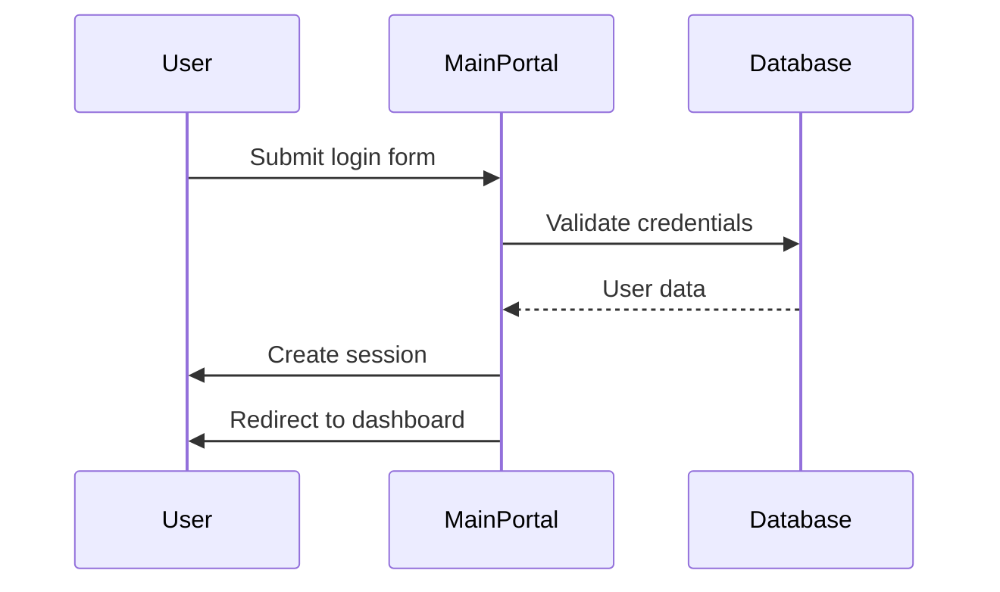
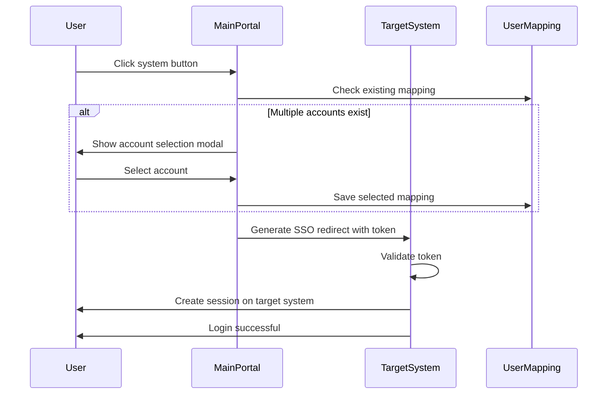
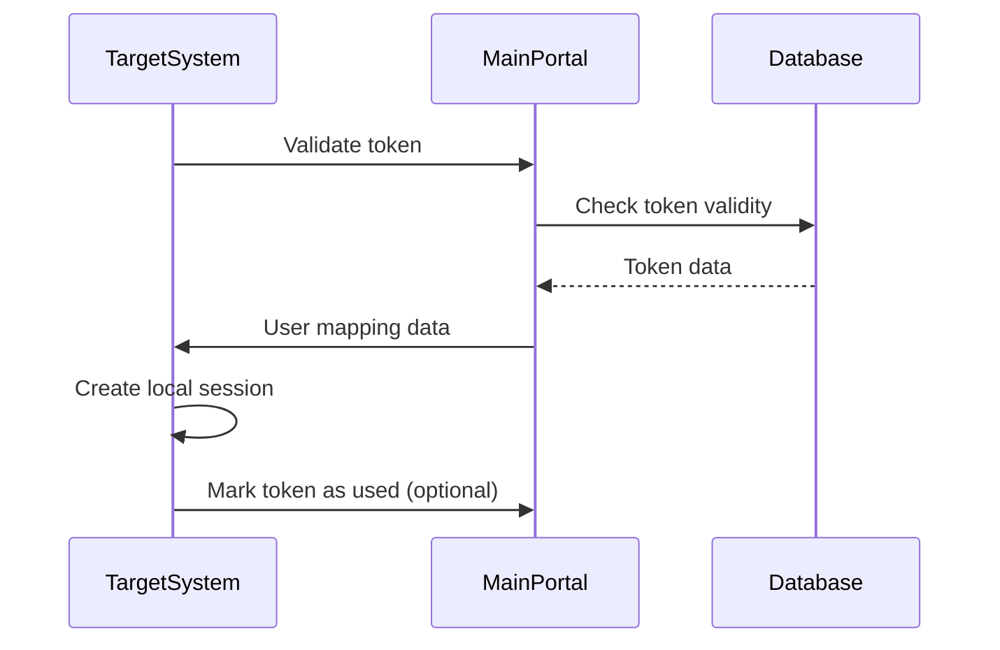
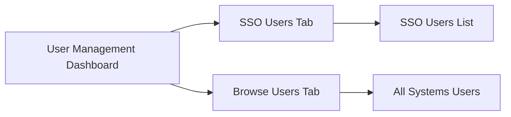
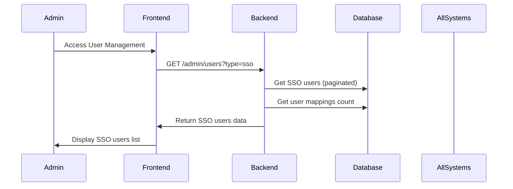
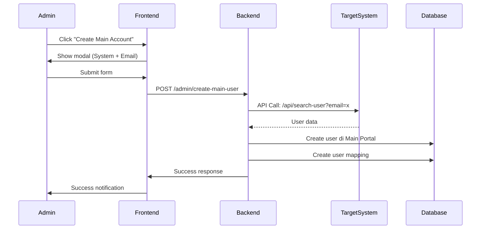
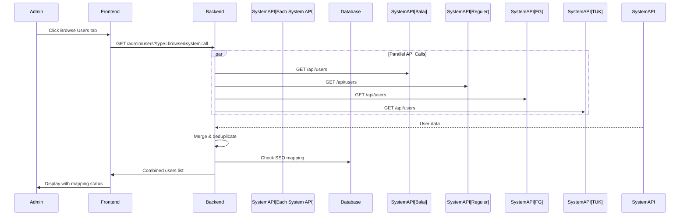
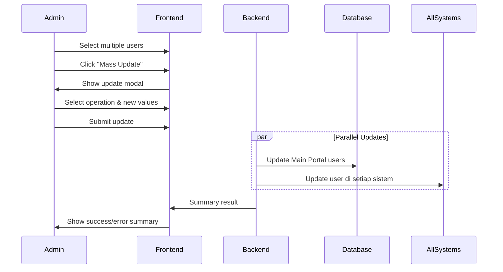
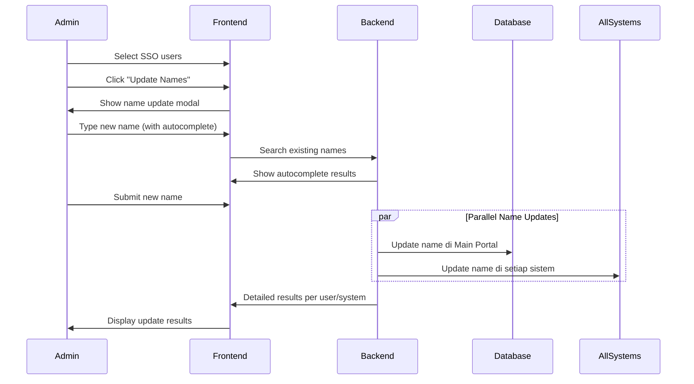
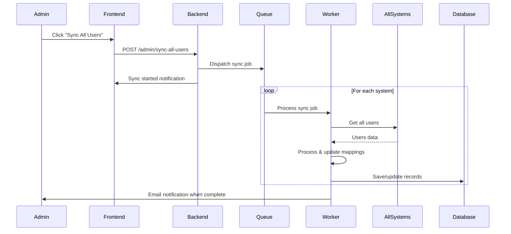

# SSO Portal Documentation

## Overview

Single Sign-On (SSO) Portal adalah sistem terpusat yang memungkinkan pengguna untuk mengakses multiple aplikasi dengan satu kali login. Portal ini berfungsi sebagai pintu masuk utama untuk 4 sistem terintegrasi LSP Gatensi.

## Sistem Arsitektur

### Komponen Utama

1. **Main Portal** (`main-portal`)
   - Aplikasi Laravel dengan Breeze authentication
   - Frontend menggunakan Alpine.js untuk interaktivitas
   - Backend service untuk manage user mapping dan token generation

2. **Sistem Terintegrasi**
   - Sistem Balai
   - Sistem Reguler
   - Sistem FG/Suisei
   - Sistem TUK

### Struktur Direktori

```
main-portal/
├── app/
│   ├── Services/
│   │   └── SSOService.php          # Core SSO logic
│   ├── Models/
│   │   ├── User.php               # Main user model
│   │   └── UserMapping.php        # User mapping model
│   └── Http/Controllers/
│       ├── AuthController.php     # Authentication
│       └── Admin/
│           ├── UserMappingController.php
│           └── UserController.php
├── resources/
│   ├── views/
│   │   ├── layouts/
│   │   │   ├── app.blade.php      # Main layout
│   │   │   └── navigation.blade.php # Sidebar navigation
│   │   ├── dashboard.blade.php    # Main dashboard
│   │   └── admin/user-management/
│   │       └── index.blade.php    # User management
│   └── js/
│       ├── dashboard-helpers.js   # Dashboard utilities
│       └── global-functions.js    # SSO functions
└── public/
    └── js/
        └── global-functions.js    # Global SSO functions
```

## Flow SSO

### 1. Login Process



#### Steps:
1. User mengakses `/login`
2. Submit form dengan email/password
3. Main portal validate credentials
4. Create session untuk user
5. Redirect ke dashboard dengan daftar sistem

### 2. System Access Flow



#### Detail Implementation:

**a. Initial Access Check**
```javascript
// When user clicks system button
function accessSystem(system) {
    selectedSystem = system;

    // AJAX check untuk multiple accounts
    fetch(`/redirect-to-system?system=${system}&ajax=1`)
        .then(response => response.json())
        .then(data => {
            if (data.status === 'multiple_matches') {
                showAccountSelectionModal(data);
            } else {
                showFloatingLoading(getSystemName(system), data.redirect_url);
            }
        });
}
```

**b. User Mapping Database**
```sql
CREATE TABLE user_mappings (
    id BIGINT PRIMARY KEY AUTO_INCREMENT,
    sso_user_id BIGINT NOT NULL,        -- User ID di Main Portal
    system_name VARCHAR(50) NOT NULL,   -- balai/reguler/fg/tuk
    system_user_id VARCHAR(255),        -- User ID di sistem target
    email VARCHAR(255) NOT NULL,
    name VARCHAR(255) NOT NULL,
    role VARCHAR(50),
    created_at TIMESTAMP,
    updated_at TIMESTAMP,

    INDEX idx_sso_system (sso_user_id, system_name),
    INDEX idx_email (email)
);
```

**c. SSO Token Generation**
```php
// Di SSOService.php
public function redirectToSystem($system, $userId = null)
{
    $userId = $userId ?? Auth::id();
    $user = User::find($userId);

    // Check mapping
    $mapping = UserMapping::where('sso_user_id', $userId)
                          ->where('system_name', $system)
                          ->first();

    if (!$mapping) {
        // Fetch user data dari target sistem
        $userData = $this->getUserFromSystem($system, $user->email);

        if (count($userData) > 1) {
            return ['status' => 'multiple_matches', 'matches' => $userData];
        }

        // Auto-create mapping jika ada 1 user
        $mapping = $this->createMapping($userId, $system, $userData[0]);
    }

    // Generate SSO token
    $token = $this->generateSSOToken($mapping);

    // Build redirect URL
    $systemConfig = $this->getSystemConfig($system);
    $redirectUrl = $systemConfig['url'] . '/sso-login?token=' . $token;

    return ['redirect_url' => $redirectUrl];
}
```

### 3. Token Validation Process



## Security Features

### 1. Token-Based Authentication

```php
// Token structure
$token = [
    'user_id' => $mapping->system_user_id,
    'email' => $mapping->email,
    'name' => $mapping->name,
    'role' => $mapping->role,
    'system' => $system,
    'timestamp' => time(),
    'expires' => time() + 300, // 5 minutes
    'signature' => hash_hmac('sha256', $payload, config('app.sso_secret'))
];
```

### 2. Security Measures

- **CSRF Protection** - Setiap request dilindungi dengan CSRF token
- **Token Expiration** - Token hanya valid selama 5 menit
- **Domain Validation** - Hanya origin dari Main Portal yang diterima
- **One-Time Use** - Token bisa di-set untuk sekali pakai
- **HTTPS Enforcement** - Semua komunikasi harus melalui HTTPS

## User Management Features

### 1. Dashboard Monitoring

Real-time statistics:
- Total sistem aktif: 4
- Jumlah pengguna per sistem
- Login harian (7 hari terakhir)
- Uptime monitoring sistem

### 2. Bulk Operations

#### Mass Update User Roles
```php
// Update multiple users across systems
public function massUpdate(Request $request)
{
    $users = $request->input('users');
    $operation = $request->input('operation');
    $newRole = $request->input('new_role');

    foreach ($users as $userId) {
        // Update di Main Portal
        $this->updateUserRole($userId, $newRole);

        // Update di semua sistem yang terintegrasi
        $this->syncUserRoleToSystems($userId, $newRole);
    }
}
```

#### Bulk Name Update
```javascript
// Frontend bulk update
async performUpdateNames() {
    const response = await fetch('/admin/bulk-update-names', {
        method: 'POST',
        headers: {
            'Content-Type': 'application/json',
            'X-CSRF-TOKEN': document.querySelector('meta[name="csrf-token"]').content
        },
        body: JSON.stringify({
            users: this.selectedSSOUsers,
            new_name: this.updateNamesForm.new_name
        })
    });

    // Handle results
    this.updateNamesResults = await response.json();
}
```

### 3. User Mapping Management

#### Automatic Mapping
1. User login ke Main Portal
2. Saat akses sistem pertama kali:
   - Cek user berdasarkan email di sistem target
   - Jika ada 1: auto-mapping
   - Jika >1: tampilkan pilihan

#### Manual Mapping
Admin bisa:
- Create main account dari sistem
- Update mapping existing users
- Delete invalid mappings

## Frontend Implementation

### 1. Sidebar Navigation

```html
<!-- Di navigation.blade.php -->
<div class="space-y-2">
    @foreach(app(\App\Services\SSOService::class)->getAvailableSystems() as $key => $system)
    <button onclick="accessSystem('{{ $key }}')" class="w-full text-left group">
        <div class="bg-gray-50 hover:bg-white border border-gray-100 rounded-lg p-3">
            <div class="flex items-center space-x-3">
                <div class="w-10 h-10 bg-white border rounded-lg">
                    
                </div>
                <div class="flex-1">
                    <h4 class="font-semibold text-xs">{{ $system['name'] }}</h4>
                    <p class="text-xs text-gray-600">{{ $system['description'] }}</p>
                </div>
                <span class="text-xs bg-green-100 text-green-700 px-2 py-0.5 rounded-full">
                    Aktif
                </span>
            </div>
        </div>
    </button>
    @endforeach
</div>
```

### 2. Loading UX

```javascript
// Floating loading modal
function showFloatingLoading(systemName, redirectUrl) {
    document.getElementById('loadingSystemName').textContent = systemName;
    const modal = document.getElementById('floatingLoadingModal');
    modal.classList.remove('hidden');

    // Animate progress bar
    const progressBar = document.getElementById('loadingProgressBar');
    progressBar.style.width = '0%';

    setTimeout(() => progressBar.style.width = '50%', 500);
    setTimeout(() => progressBar.style.width = '100%', 1500);

    setTimeout(() => {
        window.open(redirectUrl, '_blank'); // Open in new tab
        modal.classList.add('hidden'); // Hide modal
        progressBar.style.width = '0%'; // Reset
    }, 2000);
}
```

### 3. Account Selection Modal

```javascript
// Handle multiple accounts
function showAccountSelectionModal(data) {
    const message = `
        <p><strong>${data.count}</strong> akun ditemukan di ${getSystemName(selectedSystem)}</p>
        <p>Pilih akun yang ingin digunakan:</p>
    `;

    document.getElementById('accountModalMessage').innerHTML = message;

    // Render account options
    data.matches.forEach(account => {
        // Create clickable account div
        const accountDiv = createAccountDiv(account);
        document.getElementById('accountOptions').appendChild(accountDiv);
    });

    // Show modal
    document.getElementById('accountSelectionModal').classList.remove('hidden');
}
```

## API Endpoints

### 1. Authentication
- `POST /login` - User login
- `POST /logout` - User logout
- `GET /dashboard` - Dashboard dengan daftar sistem

### 2. SSO Operations
- `GET /redirect-to-system?system={name}` - Generate SSO redirect URL
- `GET /redirect-to-system?system={name}&ajax=1` - Check mapping via AJAX

### 3. User Management
- `GET /admin/users` - List all users
- `POST /admin/bulk-update-users` - Bulk update operations
- `POST /admin/bulk-update-names` - Bulk name update
- `GET /admin/user-mapping/select-account` - Account selection handler

## Configuration

### System Configuration
```php
// Di config/sso.php
return [
    'systems' => [
        'balai' => [
            'name' => 'Sistem Balai',
            'url' => 'https://balai.lsp-gatensi.id',
            'api_url' => 'https://balai.lsp-gatensi.id/api'
        ],
        'reguler' => [
            'name' => 'Sistem Reguler',
            'url' => 'https://reguler.lsp-gatensi.id',
            'api_url' => 'https://reguler.lsp-gatensi.id/api'
        ],
        // ... sistem lainnya
    ],
    'secret_key' => env('SSO_SECRET_KEY'),
    'token_expiry' => 300, // 5 minutes
];
```

## Best Practices

### 1. Security
- Selalu validate input user
- Gunakan HTTPS untuk semua komunikasi
- Implement rate limiting untuk API
- Log semua SSO activities untuk audit

### 2. Performance
- Cache system configuration
- Implement timeout untuk external API calls
- Use queue untuk bulk operations
- Optimize database queries dengan proper indexing

### 3. UX
- Berikan feedback visual untuk setiap action
- Handle edge cases (network error, timeout)
- Implement progressive loading untuk dashboard
- Use skeleton screens untuk better perceived performance

## Troubleshooting

### Common Issues

1. **Token Invalid Error**
   - Check token expiration
   - Verify secret key match antar sistem
   - Ensure request dari authorized domain

2. **Multiple Account Selection**
   - User harus memilih akun manual
   - Save mapping untuk akses berikutnya
   - Handle case untuk no matching accounts

3. **Slow Loading**
   - Check API response time
   - Implement caching untuk user data
   - Optimize database queries

### Debug Tools
- Laravel Telescope untuk API debugging
- Browser DevTools untuk network requests
- Custom logging untuk SSO flow tracking

## Future Enhancements

### Planned Features
1. **OAuth 2.0 Implementation** - Lebih secure dan standard
2. **Biometric Authentication** - Fingerprint/Face ID
3. **Mobile App Integration** - Native mobile SSO
4. **Advanced Analytics** - User behavior tracking
5. **Auto-provisioning** - Automated user account creation

### Scalability Improvements
1. **Redis for Session Storage** - Better performance
2. **Database Sharding** - For large user base
3. **Microservices Architecture** - Separate services for each function
4. **CDN for Static Assets** - Faster load times

## User Management Flow

### Overview
User Management System memungkinkan admin untuk mengelola pengguna secara terpusat di Main Portal dan sinkronisasi ke semua sistem terintegrasi.

### 1. Dashboard Overview



#### Features:
- **Two Tabs**: SSO Users (users di Main Portal) dan Browse Users (semua user di semua sistem)
- **Search & Filter**: Cari berdasarkan nama/email
- **Bulk Operations**: Update multiple users sekaligus
- **Real-time Statistics**: Jumlah user per sistem

### 2. SSO Users Management

#### 2.1 Load SSO Users Flow



**Implementation:**
```php
// Di UserController.php
public function index(Request $request)
{
    $type = $request->get('type', 'sso');

    if ($type === 'sso') {
        // Get users dari Main Portal
        $ssoUsers = User::with('mappings')
                       ->paginate(25);

        // Get statistics per system
        $stats = [];
        foreach ($this->systems as $system) {
            $stats[$system] = UserMapping::where('system_name', $system)->count();
        }

        return response()->json([
            'data' => $ssoUsers->items(),
            'current_page' => $ssoUsers->currentPage(),
            'total' => $ssoUsers->total(),
            'system_stats' => $stats
        ]);
    }
}
```

#### 2.2 Create Main Account (From External System)



**Implementation:**
```javascript
// Frontend - Create Main Account
async createMainUser() {
    try {
        const response = await fetch('/admin/create-main-user', {
            method: 'POST',
            headers: {
                'Content-Type': 'application/json',
                'X-CSRF-TOKEN': document.querySelector('meta[name="csrf-token"]').content
            },
            body: JSON.stringify({
                system: this.addMainUserForm.system,
                email: this.addMainUserForm.email
            })
        });

        if (response.ok) {
            showAlert('Main account created successfully', 'success');
            this.showCreateMainAccountModal = false;
            this.loadSSOUsers(); // Refresh list
        }
    } catch (error) {
        showAlert('Error creating main user', 'error');
    }
}
```

### 3. Browse Users Management

#### 3.1 Load All System Users



**Implementation:**
```php
// Di UserController.php - browse users
public function browseUsers(Request $request)
{
    $system = $request->get('system', 'all');
    $search = $request->get('search', '');
    $page = $request->get('page', 1);
    $perPage = 25;

    $allUsers = [];
    $systemStats = [];

    // Parallel API calls ke semua sistem
    $promises = [];
    foreach ($this->getSystems($system) as $sys) {
        $promises[$sys] = $this->fetchUsersFromSystem($sys, $search);
    }

    // Execute parallel calls
    $results = Promise::settle($promises)->wait();

    // Process results
    foreach ($results as $system => $result) {
        if ($result['state'] === 'fulfilled') {
            $users = $result['value'];
            $allUsers = array_merge($allUsers, $users);

            // Mark users dengan SSO mapping
            foreach ($users as &$user) {
                $mapping = UserMapping::where('system_user_id', $user['id'])
                                   ->where('system_name', $system)
                                   ->first();
                $user['has_sso'] = !!$mapping;
                $user['sso_email'] = $mapping ? $mapping->email : null;
            }

            $systemStats[$system] = count($users);
        }
    }

    // Pagination
    $offset = ($page - 1) * $perPage;
    $paginatedUsers = array_slice($allUsers, $offset, $perPage);

    return response()->json([
        'data' => $paginatedUsers,
        'current_page' => $page,
        'total' => count($allUsers),
        'system' => $system,
        'system_stats' => $systemStats
    ]);
}
```

#### 3.2 Search & Filter System Users

```javascript
// Frontend - Search dengan debounce
searchUsers() {
    // Clear previous timeout
    if (this.searchTimeout) {
        clearTimeout(this.searchTimeout);
    }

    // Debounce search 500ms
    this.searchTimeout = setTimeout(() => {
        this.loadBrowseUsers();
    }, 500);
}

// System filter
filterBySystem(system) {
    this.activeSystem = system;
    this.page = 1;
    this.loadBrowseUsers();
}
```

### 4. Bulk Operations

#### 4.1 Mass Update (Role & Email)



**Implementation:**
```php
// Di UserController.php - bulk update
public function bulkUpdateUsers(Request $request)
{
    $users = $request->input('users'); // Array of user IDs
    $operation = $request->input('operation');
    $newRole = $request->input('new_role');
    $newEmail = $request->input('new_email');
    $sendEmail = $request->input('send_email', false);

    $summary = [
        'successful' => 0,
        'errors' => 0,
        'details' => []
    ];

    foreach ($users as $userId) {
        try {
            // Update di Main Portal
            $ssoUser = User::find($userId['sso_id']);
            if ($ssoUser) {
                if ($operation === 'role') {
                    $ssoUser->role = $newRole;
                } elseif ($operation === 'email') {
                    $ssoUser->email = $newEmail;
                }
                $ssoUser->save();
            }

            // Update di semua sistem yang terintegrasi
            $mappings = UserMapping::where('sso_user_id', $userId['sso_id'])->get();
            foreach ($mappings as $mapping) {
                $result = $this->updateUserInSystem(
                    $mapping->system_name,
                    $mapping->system_user_id,
                    $operation,
                    $newRole ?: $newEmail
                );

                if ($result['success']) {
                    $summary['successful']++;
                    // Send notification email if required
                    if ($sendEmail) {
                        $this->sendUpdateNotification($ssoUser, $operation);
                    }
                } else {
                    $summary['errors']++;
                    $summary['details'][] = [
                        'user' => $ssoUser->email,
                        'system' => $mapping->system_name,
                        'error' => $result['message']
                    ];
                }
            }
        } catch (\Exception $e) {
            $summary['errors']++;
            $summary['details'][] = [
                'user' => $userId['email'] ?? 'Unknown',
                'error' => $e->getMessage()
            ];
        }
    }

    return response()->json([
        'success' => true,
        'summary' => $summary
    ]);
}
```

#### 4.2 Bulk Name Update



**Autocomplete Implementation:**
```javascript
// Frontend - Name autocomplete
async searchUserNames(query) {
    if (query.length < 2) return;

    try {
        const response = await fetch(`/admin/search-names?q=${encodeURIComponent(query)}`);
        const results = await response.json();

        this.searchResults = results;
        this.showUserSearchDropdown = true;
    } catch (error) {
        console.error('Search error:', error);
    }
}

// Select name from autocomplete
selectName(name) {
    this.updateNamesForm.new_name = name;
    this.showUserSearchDropdown = false;
    this.searchResults = [];
}
```

### 5. User Synchronization

#### 5.1 Sync All Users



**Job Implementation:**
```php
// Di app/Jobs/SyncUsersJob.php
class SyncUsersJob implements ShouldQueue
{
    use Dispatchable, InteractsWithQueue, Queueable, SerializesModels;

    public function handle()
    {
        foreach (config('sso.systems') as $system => $config) {
            try {
                // Get all users dari sistem
                $response = Http::timeout(30)
                              ->get($config['api_url'] . '/users');

                $users = $response->json();

                // Process each user
                foreach ($users as $userData) {
                    // Cek atau create mapping
                    $mapping = UserMapping::updateOrCreate(
                        [
                            'system_name' => $system,
                            'system_user_id' => $userData['id']
                        ],
                        [
                            'email' => $userData['email'],
                            'name' => $userData['name'],
                            'role' => $userData['role'] ?? 'user',
                            'updated_at' => now()
                        ]
                    );

                    // Auto-create SSO user jika belum ada
                    if (!$mapping->sso_user_id) {
                        $ssoUser = User::firstOrCreate(
                            ['email' => $userData['email']],
                            [
                                'name' => $userData['name'],
                                'password' => Hash::make(Str::random(32)), // Random password
                                'role' => $userData['role'] ?? 'user'
                            ]
                        );

                        $mapping->sso_user_id = $ssoUser->id;
                        $mapping->save();
                    }
                }

            } catch (\Exception $e) {
                Log::error("Sync failed for {$system}: " . $e->getMessage());
            }
        }
    }
}
```

### 6. Data Structure

#### 6.1 User Response Format

**SSO Users Response:**
```json
{
    "data": [
        {
            "id": 1,
            "name": "John Doe",
            "email": "john@example.com",
            "role": "admin",
            "created_at": "2024-01-01T00:00:00Z",
            "mappings": [
                {
                    "system_name": "balai",
                    "system_user_id": "1001",
                    "last_login": "2024-01-15T10:00:00Z"
                }
            ],
            "mapping_count": 1
        }
    ],
    "current_page": 1,
    "total": 100,
    "system_stats": {
        "balai": 25,
        "reguler": 30,
        "fg": 20,
        "tuk": 25
    }
}
```

**Browse Users Response:**
```json
{
    "data": [
        {
            "id": "1001",
            "name": "John Doe",
            "email": "john@example.com",
            "system": "balai",
            "role": "user",
            "has_sso": true,
            "sso_email": "john@example.com"
        },
        {
            "id": "2001",
            "name": "Jane Smith",
            "email": "jane@example.com",
            "system": "reguler",
            "role": "admin",
            "has_sso": false,
            "sso_email": null
        }
    ],
    "current_page": 1,
    "total": 4398,
    "system": "all"
}
```

#### 6.2 Bulk Update Response

```json
{
    "success": true,
    "summary": {
        "successful": 23,
        "errors": 2,
        "details": [
            {
                "user": "error@example.com",
                "system": "balai",
                "error": "API timeout"
            }
        ]
    }
}
```

### 7. Frontend State Management

#### 7.1 Alpine.js Component Structure

```javascript
function userManagement() {
    return {
        // Tab management
        activeTab: 'sso', // 'sso' or 'browse'

        // SSO Users state
        ssoUsers: { data: [] },
        selectedSSOUsers: [],

        // Browse Users state
        users: { data: [] },
        selectedBrowseUsers: [],
        activeSystem: 'all',
        search: '',

        // Loading states
        loading: {
            ssoUsers: false,
            browseUsers: false
        },

        // Modals state
        showMassUpdateModal: false,
        showUpdateNamesModal: false,
        showCreateMainAccountModal: false,

        // Forms
        massUpdateForm: {
            operation: '',
            new_role: '',
            new_email: '',
            send_email: false
        },
        updateNamesForm: {
            new_name: ''
        },
        addMainUserForm: {
            system: '',
            email: ''
        },

        // Methods
        switchTab(tab) {
            this.activeTab = tab;
            if (tab === 'sso') {
                this.loadSSOUsers();
            } else {
                this.loadBrowseUsers();
            }
        },

        async loadSSOUsers() {
            // Load users dari Main Portal
        },

        async loadBrowseUsers() {
            // Load users dari semua sistem
        },

        async performBulkUpdate() {
            // Execute bulk update
        },

        async performUpdateNames() {
            // Update nama untuk selected users
        }
    };
}
```

### 8. Performance Optimizations

#### 8.1 Frontend Optimizations
- **Debounce Search**: 500ms delay untuk search input
- **Virtual Scrolling**: Untuk long lists
- **Lazy Loading**: Load data saat tab di-klik
- **Skeleton Loading**: Show skeleton saat fetch data

#### 8.2 Backend Optimizations
- **Parallel API Calls**: Guzzle Promises untuk multiple systems
- **Eager Loading**: `with('mappings')` untuk减少 N+1 queries
- **Pagination**: Limit 25 users per page
- **Queue Jobs**: Bulk operations menggunakan queue

### 9. Error Handling

#### 9.1 Network Errors
- Retry mechanism untuk failed API calls
- Fallback ke cached data jika offline
- Clear error messages untuk user

#### 9.2 Validation Errors
- Client-side validation sebelum submit
- Server-side validation dengan proper error responses
- Clear feedback untuk user

## Conclusion

SSO Portal ini mengimplementasikan Single Sign-On yang robust dengan fokus pada:
- **Security** - Token-based auth dengan proper validation
- **UX** - Smooth transitions dengan loading feedback
- **Maintainability** - Clean architecture dengan separation of concerns
- **Scalability** - Designed untuk handle multiple integrations

Dengan dokumentasi ini, developer baru dapat memahami arsitektur sistem dan melakukan maintenance atau enhancement dengan lebih mudah.